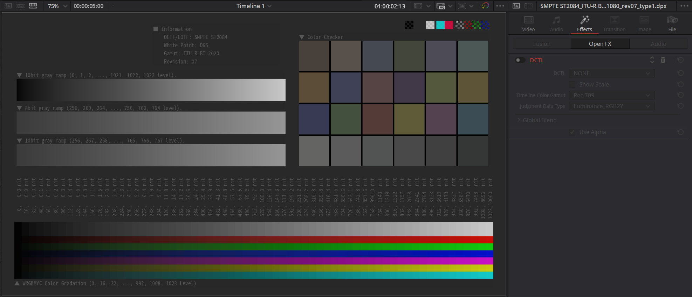
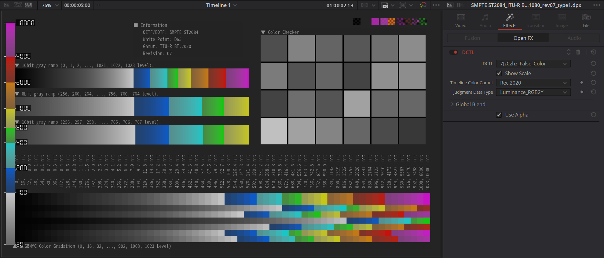

# Luminance Map (7JzCzhz False Color)

Luminance Map (7JzCzhz False Color) is a simple effect for DaVinci Resolve, implemented using DaVinci Color Transform Language (DCTL).

It allows you to create false color effects based on the luminance of HDR10 content.

## Description

This effect applies a false color display to an HDR signal based on its luminance level, as illustrated in the figure below.

I developed this effect as part of my exploration into DCTL.

| Original Image |  |
|:--------------:|:-------------------------------------------------------------------------------------------------:|
| Effect Applied |  |

## Demo

Watch the demo on [YouTube](https://youtu.be/CVPQD-OdkGU).

## Getting started

### Requrements

- DaVinci Resolve 19.1 or later.

### Installation

Copy the `DCTL` directory into DaVinci Resolve's LUT directory.

* Windows: `C:\ProgramData\Blackmagic Design\DaVinci Resolve\Support\LUT`
* macOS: `/Library/Application Support/Blackmagic Design/DaVinci Resolve/LUT`

### DaVinci Resolve Settings

Unless you have a specific reason not to, apply the following settings:

1. Set the gamma for the "Timeline Color Space" to either "ST2084" or "Rec.2100 ST2084."
2. Set both "Input DRT" and "Output DRT" to "None."

|  |
|:---------------------------------------------------------------------------------------------------------------------:|
| *Recommended configuration for "Color Management"* |

**Note:** This effect works correctly only with the ST2084 gamma curve. It is also strongly recommended to disable DRT, as the purpose of this effect is to analyze an HDR signal that has already been color graded.

### Applying the effect

1. Apply the DCTL effect to your HDR video on the timeline.
2. Select "hdr_luminance_map" from the DCTL list in the Effects settings.
3. Configure the following parameters:

| Parameter Name        | Description                                                                     |
|-----------------------|---------------------------------------------------------------------------------|
| Timeline Color Gamut  | Set this value to match your "Timeline Color Space."                            |
| Judgment Data Type    | Choose between "Luminance_RGB2Y" and "Max_Value_Among_RGB."                     |
